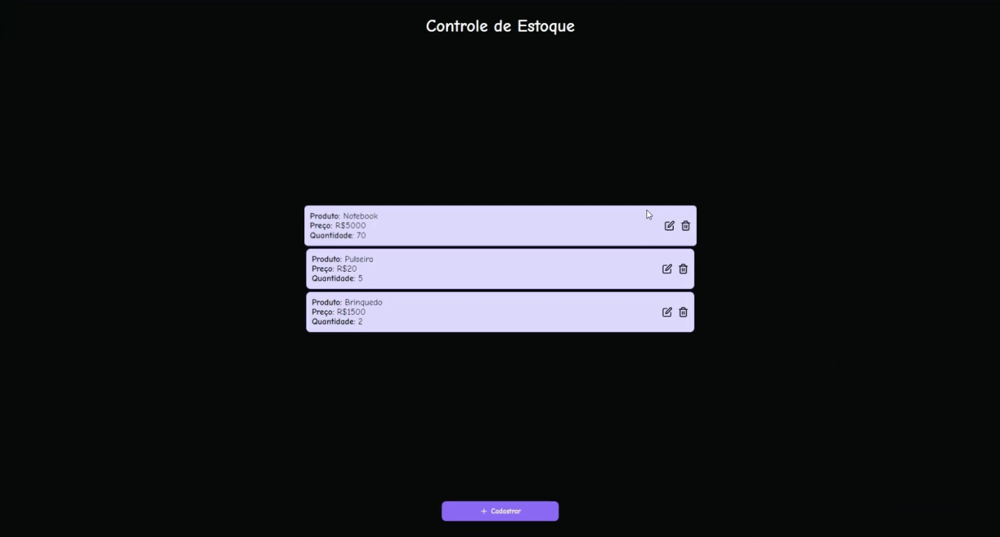

<h1 align="center"> Controle de Estoque </h1>

Descrição do projeto, como foi feito/com quem, doq c trata e papapa 

  <a href="#-tecnologias">Tecnologias</a>&nbsp;&nbsp;&nbsp;|&nbsp;&nbsp;&nbsp;
  <a href="#-projeto">Projeto</a>

 

  <!-- Exibe o vídeo -->
  <video width="640" height="360" controls>
    <source src="software.mp4" type="video/mp4">
  </video>
  
  <!-- Link para download do vídeo -->
   
  </img>
  <a href="https://github.com/Isaluh/controleEstoqueAtividadeAvaliativa/blob/main/software.mp4?download" download="software.mp4">
    Baixar vídeo
  </a>

## 🎓 Tecnologias

Esse projeto foi desenvolvido com as seguintes tecnologias:

- Spring Boot
- Java
- HTML e CSS
- JavaScript
- Git e Github

## 📔 Projeto

Construa um software em Java, utilizando Java Swing, como front-end que para controlar o cadastro de preço de alguns produtos. Esse software terá as seguintes

funcionalidades:
- cadastro de produtos (nome e preço)
- deleção de produtos
- alteração do preço dos produtos
- listagem dos produtos

Aplique as seguintes regras de negócio:
Na tela de cadastro e alteração de produtos, o preço do produto deverá ser maior que 0,00
Utilize como estratégia para armazenamento dos dados, a estrutura de dados Hashmap. 

---

<h4 align="center">By: Lisa  🤍</h4>